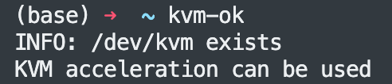

# 1、检查CPU是否支持虚拟化
`grep -Eoc '(vmx|svm)' /proc/cpuinfo`<br>
结果大于0即可
# 2、安装检查工具
`sudo apt update && sudo apt install cpu-checker -y
`<br>
然后运行：<br>
`kvm-ok`<br>
出现：

即可。
# 3、安装kvm虚拟化套件
`apt install qemu-kvm libvirt-daemon-system libvirt-clients bridge-utils virtinst virt-manager -y`<br>
其中：

`qemu-kvm`提供硬件底层虚拟化<br>
`libvirt-daemon-system`为libvirt作为系统服务的守护程序运行<br>
`libvirt-clients`为不同的虚拟机提供长期稳定的客户端API<br>
`bridge-utils`提供网络桥接功能<br>
`virtinst`为libvirt创建虚拟机提供一系列的命令行工作<br>
`virt-manager`KVM虚拟机管理图形界面，如果服务器没有安装图形化界面，没有必要安装它<br>

检查libvirtd是否正在运行:  
`systemctl is-active libvirtd`<br>

# 4、查看虚拟网络
`brctl show`

# 5、安装命令
```
virt-install \
--name=centos7_5  --ram=16384  --vcpus=16 \
--virt-type=kvm --os-type=linux --os-variant=centos7.0 \
--network default,model=virtio --accelerate \
--location=/opt/images/CentOS-7-x86_64-Minimal-2009.iso \
--disk path=/opt/virtualhost/CentOS7_5.qcow2,device=disk,format=qcow2,bus=virtio,cache=writeback,size=40 \
--graphics=none --console=pty,target_type=serial \
--extra-args="console=tty0 console=ttyS0"
```
# 6、处理虚拟机不能连接外网
`cd /etc/sysconfig/network-scripts`  
`vi ifcfg-eth0`  
将ONBOOT=no改为ONBOOT=yes，然后重启服务。 
`systemctl restart network`
# 7、更改yum软件源
`wget -O /etc/yum.repos.d/CentOS-Base.repo http://mirrors.aliyun.com/repo/Centos-7.repo`  
# 8、安装ifconfig
`yum install net-tools -y`  
# 9、ssh连接太慢解决方法
`vim /etc/ssh/sshd_config`  
修改：
```
UseDNS => no
GSSAPIAuthentication => no
```
然后重启服务：  `systemctl restart sshd`
# 10、退出虚拟机
快捷键：ctrl+]

